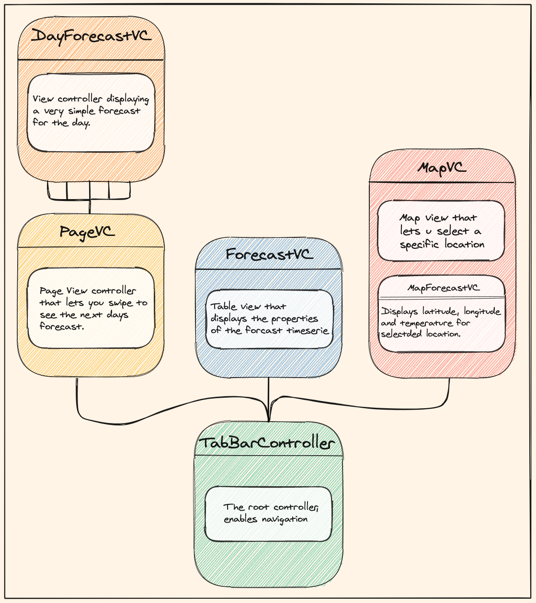

# iOs-weather-app

#### Built with: 
- Xcode 12.1 
    - Build version 12A7403
- Apple Swift version 5.3 (swiftlang-1200.0.29.2 clang-1200.0.30.1)
    - Target: x86_64-apple-darwin19.5.0
- Deployment Target: iOS 14.0

- iPhone 11 in simulator

---

### Application structure:

- Data is stored in singleton instances, that acts as a "global state"". 

- The instance gets initialized when det data is finished fetching.

- When new data is fetch, the singleton gets reinitialized.

- This is not "thread safe" (I have not really grasped this concept yet). 

#### Navigation:

- Consists of the following view controllers:

    - The RootController, which is a UITabBarController enabling navigation between:
    
        - PageViewController, which lets you swipe through the forcasts of the coming days.
        
            - The PageViewController consists of multiple DayForcastViewControllers.
            
       - ForecastViewController, which consists of a table view displaying the weather for the nexxt twele hours.
       
       - MapForecastViewController, which consits of a MapView, and a MapForecastView displaying info for the selected location on the map.    
           
Here's an illustration of the navigation flow:     

*Illustration of the navigation flow. Made with [Excalidraw](https://excalidraw.com/).*

------

### How the app gets data:

- The apllication gets it's data from the norwegian [Meteorological Institute public API](https://api.met.no/weatherapi/locationforecast/2.0/documentation).  

- It uses version 2 of the compact location forecast.

- URLSession is used to fetch data from the endpoint.
 
- FileManager is used to store the response data on the device.

This application stores the JSON response directly to the disk in two sepperate files.  
Each file represent different types of weatherforecasts:

* The specificWeatherForecast.json:
   
   - Keeps the data for a specific location.
   
   - This file gets updated each time you set a new pin on the map.
  
* The currentWeatherForcast.json:

  - Keeps the data for your current location.
  
  - This file gets updated at app launch, or when the CLLocationManager udates your location.
  
  - Since the forecast from the API is accurate down to 1km, the location accuracy is set to 1km.

Check out this illustration to get an overview:

*Illustration of the data flow. Made with [Excalidraw](https://excalidraw.com/).*

------

### How I've worked to get this done

This application is made with a mixture of deep diggs into stackoverflow, google, 
and the course material from [Beining & Bogen's](http://www.beiningbogen.no) iOS-programming [repository](https://github.com/BeiningBogen/iOS-Kristiania).   

I decided to take a programatically approach to the assignment, so no storyboard is used.
This is just a personal preference, and i find it more fun and responsive doing it this way.   
There are probably loads of pros and cons regarding this approach vs using the Interface Builder.
In my experience it gave me a solid understanding of how things works "under the hood".   

#### Sources:
 - https://www.youtube.com/watch?v=sqo844saoC4&ab_channel=iOSAcademy
 
 - https://gist.github.com/saoudrizwan/b7ab1febde724c6f30d8a555ea779140
 
 - https://stackoverflow.com/questions/25296691/get-users-current-location-coordinates
 
 - https://medium.com/cleansoftware/quickly-implement-tableview-collectionview-programmatically-df12da694af9
 
 - https://stackoverflow.com/questions/34431459/ios-swift-how-to-add-pinpoint-to-map-on-touch-and-get-detailed-address-of-th
 
 - https://www.raywenderlich.com/5371-grand-central-dispatch-tutorial-for-swift-4-part-2-2
 
 - Icons:
    - https://www.flaticon.com/
    - met.no's  [weather icons](https://api.met.no/weatherapi/weathericon/2.0/documentation)
